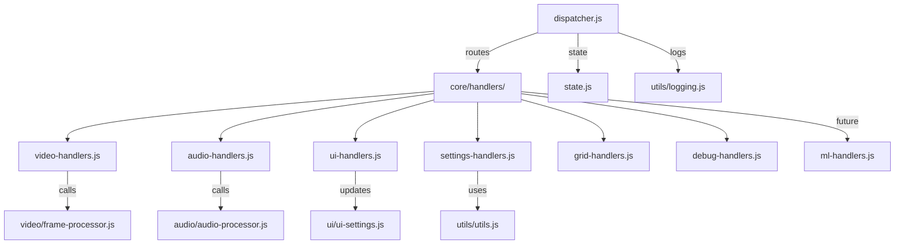

**a photon to phonon code**

## [Introduction](#introduction)

The content in this repository provides code and docs of an accessibility web app that aims to help visually impaired users by transforming visual environments into soundscapes in real time.

> We believe in enhancing humanity with open-source software. You are invited to join us improving this mission and make a difference!

### Project Vision

- Synesthetic Translation: Converting visual data such as a live camera feed into stereo audio cues, mapping colors, shapes and motions to distinct sound signatures.
- Dynamic Soundscapes for Location-Aware Audio: Adjusts audio in real time based on object distance and motion, e.g., an object approaching shifts the sound in tone, volume and complexity as it moves.


### Tech stack needed

Development: Pure Vanilla JS with no external dependency

Software: Runs in a web browser from 2020 and up (ES6+)
Hardware: The design is tested with low settings on a mobile phone from 2020. 
Input: Video camera for real-time visual data capture.
Audio Output: Stereo headphones or speakers for spatial audio effects.

### BRIEF

Entirely coded by xAI Grok 3 to Milestone 4 as per @MAMware prompts 
Milestone 5 got help from OpenAI ChatGPT 4.1, 04-mini, Anthropic Claude 4 via @github copilot at codespaces and also Grok 4 wich is charge of the re-estructuring from v0.5.12
Currently at Milestone 9 (26.02.09) the project is developed in private and near public annoucement. 

## Table of Contents

- [Introduction](#introduction)
- [Usage](docs/USAGE.md)
- [Status](#status)
- [Project structure](#project_structure)
- [Changelog](docs/CHANGELOG.md)
- [Contributing](docs/CONTRIBUTING.md)
- [To-Do List](docs/TO_DO.md)
- [Diagrams](docs/DIAGRAMS.md)
- [License](docs/LICENSE.md)
- [FAQ](docs/FAQ.md)

### [Usage](docs/USAGE.md)

The webapp runs from a Internet browsers and mobile hardware from 2021.

- Current version [RUN](https://mamware.github.io/acoustsee/present/)
- Previous versions [RUN](https://mamware.github.io/acoustsee/past/old_versions/preview)
- Testing developments [RUN](https://mamware.github.io/acoustsee/future/web)

### Check [Usage](docs/USAGE.md) for further details

### [Current Status](#status) **OUTDATED**

Working at **Milestone 5 (Current)** 
- Haptic feedback via Vibration API **Developing in Progress 85%** 
- Console log on device screen and mail to feature for debuggin. **Developing in Progress 85%**
- New languajes agnostic architecture ready to provide multilingual support for the speech sinthetizer and UI  **Developing in Progress 95%**
- Mermaid diagrams to reflect current Modular Single Responsability Principle **To do**
 
### [Changelog](docs/CHANGELOG.md)

- Current "stable" version from "present" is v0.4.7, link above logs the history and details past milestones achieved.
- Current "future" version in development starts from v0.5 

### [Project structure](#project_structure)
WARN: this is alpha stage and is only meant for testing purposing using the Sinewave synth, some synths like Strings cause VERY HIGH NOISE that could damage hearing and speakers. 

- Current version [RUN](https://mamware.github.io/acoustsee/present/)
- Previous versions [RUN](https://mamware.github.io/acoustsee/past/old_versions/preview)
- Test version in development [RUN](https://mamware.github.io/acoustsee/future/web)

### [Current Status](#status) 

- Milestone 0 to 4: reached by vibecoding with xAI Grok 3 
- Milestone 5:  reached byv ibecoded with SuperGrok 4. some assistance from Gemini 2.5 Pro (Preview), ChatGPT 4.1 & o4-mini agents + small reviews from Claude 4.
- Milestone 6:  restructered with Gemini 2.5 Pro and ChatGPT 4.1 & 04-mini agents 
- Milestone 6.5: (WIP) robust architectural improvements and integration work by GPT-5 mini (Preview)
- Milestone 7 to 9: mayor redesign with a foundational Command pattern and Hexagonal architecture while still in plain vanilla JS, not merged to developing branch becouse this actually a complete rebase. 

### [v0.6 Project structure, (in construction)](#project_structure)

```

web/
├── audio/                    # Audio synthesis/processing (notes-to-sound, HRTF, mic)
│   ├── audio-controls.js     # PowerOn/AudioContext init
│   ├── audio-manager.js      # AudioContext management
│   ├── audio-processor.js    # Core audio (oscillators, playAudio, cleanup; integrates HRTF/ML depth)
│   ├── hrtf-processor.js     # HRTF logic (PannerNode, positional filtering)
│   └── synths/               # Synth methods (extend with HRTF)
│       ├── sine-wave.js
│       ├── fm-synthesis.js
│       └── available-engines.json
├── video/                    # Video capture/mapping (camera-to-notes/positions; includes ML depth)
│   ├── video-capture.js      # Stream setup/cleanup
│   ├── frame-processor.js    # Frame analysis (emits notes/positions; calls ML if enabled)
│   ├── ml-depth-processor.js # New: Monocular depth estimation 
│   └── grids/                # Visual mappings 
│       ├── hex-tonnetz.js
│       ├── circle-of-fifths.js
│       └── available-grids.json
├── core/                     # Orchestration (events, state)
│   ├── dispatcher.js         # Event handling 
│   ├── state.js              # Settings/configs 
│   └── context.js            # Shared refs
├── ui/                       # Presentation (buttons, DOM; optional ML/HRTF toggles)
│   ├── ui-controller.js      # UI setup
│   ├── ui-settings.js        # Button bindings 
│   ├── cleanup-manager.js    # Teardown listeners
│   └── dom.js                # DOM init
├── utils/                    # Cross-cutting tools (TTS, haptics, logs)
│   ├── async.js              # Error wrappers
│   ├── idb-logger.js         # Persistent logs
│   ├── logging.js            # Structured logs
│   └── utils.js              # Helpers (getText, ...)
├── languages/                # Localization (add ML/HRTF strings)
│   ├── es-ES.json
│   ├── en-US.json
│   └── available-languages.json
├── test/                     # Tests (grouped by category)
│   ├── audio/                # Audio/HRTF tests
│   │   ├── audio-processor.test.js
│   │   └── hrtf-processor.test.js
│   ├── video/                # Video/grid/ML tests
│   │   ├── frame-processor.test.js
│   │   └── ml-depth-processor.test.js  # New: Test depth estimation
│   ├── core/                 # Dispatcher/state tests (if added)
│   ├── ui/                   # UI tests
│   │   ├── ui-settings.test.js
│   │   └── video-capture.test.js
│   └── utils/                # Utils tests (if added)
├── .eslintrc.json            # Linting
├── index.html                # HTML entry
├── main.js                   # Bootstrap (update imports for moves/ML init)
├── README.md                 # Docs (update structure/ML/HRTF)
└── styles.css                # Styles

```

### [Contributing](docs/CONTRIBUTING.md)

>We welcome contributors! 

- At this document linked above, you will find the list for our current TO TO list, now from milestone 5 (v0.5.2)

### [Code flow diagrams](docs/DIAGRAMS.md) 

Diagrams covering the Turnk Based Development approach (v0.2). 

  - Process Frame Flow
  - Audio Generation Flow
  - Motion Detection such as oscillator logic.


### [Changelog](docs/CHANGELOG.md)

- Current "stable" version from "present" is v0.4.7, the link above logs the history and details past milestones achieved.
- Current "future" version in development starts from v0.6 

### [FAQ](docs/FAQ.md)

- Follow the link for list of the Frecuently Asqued Questions.

### [License](docs/LICENSE.md)

- GPL-3.0 license details
  
Peace
Love
Union
Respect


