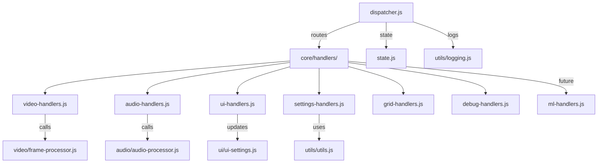

**a photon to phonon code**

## [Introduction](#introduction)

The content in this repository is meant to provide the code for a public infraestructure web app that aims to transform visual environments into soundscapes, empowering the users to experience the visual world by synthetic audio cues, in real time.

> **Why?** We believe in enhancing humanity with open-source software in a fast, accessible and impactful way. You are invited to join us to improve its mission and make a difference!

### Project Vision

- Synesthetic Translation: Converting visual data into stereo audio cues, mapping colors, motion to distinct sound signatures.
- Dynamic Soundscapes: Adjusts audio in real time based on object distance and motion, e.g., a swing’s sound shifts in volume and complexity as it moves.
- Location-Aware Audio: Enhances spatial awareness by producing sounds in the corresponding ear, such as a wall on the left sounding in the left ear.

### Tech stack needed

Run the version of your choice in any internet browser from year 2020 and up.
The design is tested with a mobile phone anda its front camera
Input: Mobile camera for real-time visual data capture.
Audio Output: Stereo headphones for spatial audio effects.

### Hipothetic Use Case

Launch the app on a mobile device to translate live camera input into a dynamic stereo soundscape. For a visually impaired user in a park, a mobile phone worn as a necklace captures surrounding visuals like a swing in motion, as the swing moves away, the app produces a softer, simpler sound; as it approaches, the sound grows louder and more complex. Similarly, a sidewalk might emit a steady, textured tone, a car in the distance a low hum, and a wall to the left a localized sound in the left ear. This enables users to perceive and interact with their surroundings through an innovative auditory interface, fostering greater independence and environmental awareness.

### Development

Entirely coded by xAI Grok 3 to Milestone 4 as per @MAMware prompts 
Milestone 5 wich is a work in progress is getting help from OpenAI ChatGPT 4.1, 04-mini, Anthropic Claude 4 via @github copilot at codespaces and also Grok 4 wich is charge of the re-estructuring from v0.5.12

>We welcome contributors! 

## Table of Contents

- [Introduction](#introduction)
- [Usage](docs/USAGE.md)
- [Status](#status)
- [Project structure](#project_structure)
- [Changelog](docs/CHANGELOG.md)
- [Contributing](docs/CONTRIBUTING.md)
- [To-Do List](docs/TO_DO.md)
- [Diagrams](docs/DIAGRAMS.md)
- [License](docs/LICENSE.md)
- [FAQ](docs/FAQ.md)

### [Usage](docs/USAGE.md)

The webapp runs from a Internet browsers and mobile hardware from 2021.

- Current version [RUN](https://mamware.github.io/acoustsee/present/)
- Previous versions [RUN](https://mamware.github.io/acoustsee/past/old_versions/preview)
- Testing developments [RUN](https://mamware.github.io/acoustsee/future/web)

### Check [Usage](docs/USAGE.md) for further details

### [Current Status](#status) 

Working at **Milestone 5 (Current)**

- Haptic feedback via Vibration API **Developing in Progress 85%** 
- Console log on device screen and mail to feature for debuggin. **Developing in Progress 85%**
- New languajes agnostic architecture ready to provide multilingual support for the speech sinthetizer and UI  **Developing in Progress 95%**
- Mermaid diagrams to reflect current Modular Single Responsability Principle **To do**
 
### [Changelog](docs/CHANGELOG.md)

- Current "stable" version from "present" is v0.4.7, link above logs the history and details past milestones achieved.
- Current "future" version in development starts from v0.5 

### ["future" Project structure](#project_structure)

```

web/
├── audio/                    # Audio processing and synthesis
│   ├── audio-processor.js    # AudioContext, oscillators, mic handling
│   ├── synthesis-engines/    # Synthesis methods (sine-wave.js, fm-synthesis.js)
│   │   ├── sine-wave.js
│   │   ├── fm-synthesis.js
│   │   └── available-engines.json
│   └── audio-controls.js     # PowerOn button and AudioContext initialization (moved from ui)
├── core/                     # Core application logic and state
│   ├── dispatcher.js         # Event dispatching (renamed from event-dispatcher.js)
│   ├── frame-processor.js    # Frame-to-notes mapping (moved from ui)
│   ├── state.js              # Global settings and config loading
│   └── context.js            # Shared DOM and dispatcher context
├── ui/                       # Strictly UI-related code (DOM, buttons, rendering)
│   ├── ui-controller.js      # UI setup and orchestration
│   ├── ui-settings.js        # Button event bindings
│   ├── video-capture.js      # Video feed rendering and canvas setup (refocused from processing)
│   └── dom.js                # DOM element initialization
├── utils/                    # General-purpose utilities
│   ├── logging.js            # Structured logging
│   ├── idb-logger.js         # IndexedDB logging
│   ├── utils.js              # General utilities (tryVibrate, hapticCount, getText, etc.)
│   └── async.js              # Async utilities (withErrorBoundary)
├── synthesis-grids/          # Grid-based synthesis methods
│   ├── hex-tonnetz.js
│   ├── circle-of-fifths.js
│   └── available-grids.json
├── languages/                # Language and translation files
│   ├── es-ES.json
│   ├── en-US.json
│   └── available-languages.json
├── styles.css                # Global styles
├── index.html                # Main HTML
├── main.js                   # Application entry point
└── test/                     # Tests
    ├── ui-settings.test.js
    └── video-capture.test.js

```

### [Contributing](docs/CONTRIBUTING.md)

>We welcome contributors! 

- At this document linked above, you will find the list for our current TO TO list, now from milestone 5 (v0.5.2)

### [Code flow diagrams](docs/DIAGRAMS.md) 

Diagrams covering the Turnk Based Development approach (v0.2). 

  - Process Frame Flow
  - Audio Generation Flow
  - Motion Detection such as oscillator logic.


### [Changelog](docs/CHANGELOG.md)

- Current "stable" version from "present" is v0.4.7, the link above logs the history and details past milestones achieved.
- Current "future" version in development starts from v0.6 

### [FAQ](docs/FAQ.md)

- Follow the link for list of the Frecuently Asqued Questions.

### [License](docs/LICENSE.md)

- GPL-3.0 license details
  
Peace
Love
Union
Respect


