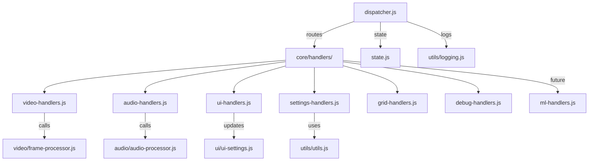

[](https://github.com/MAMware/acoustsee/actions/workflows/e2e.yml) [)](https://github.com/MAMware/acoustsee/actions/workflows/e2e.yml)

## [Introduction](#introduction)

### Project Vision

The content at this repository builds a web app that aims to transform visual environments into intuitive soundscapes thus experiencing the visual world by synthetic audio cues in real time, generating dynamic soundscapes by mapping motion into distinct sound signatures.
 

> We believe in software that improves quality of life. Enhancing accessibility with open-source tools is central to this mission. You're welcome to contribute.


## Table of Contents

- [Introduction](#introduction)
- [Usage](docs/USAGE.md)
- [Status](#status)
- [Project structure](#project_structure)
- [Changelog](docs/CHANGELOG.md)
- [Contributing](docs/CONTRIBUTING.md)
- [To-Do List](docs/TO_DO.md)
- [Diagrams](docs/DIAGRAMS.md)
- [License](docs/LICENSE.md)
- [FAQ](docs/FAQ.md)

### [Usage](docs/USAGE.md)

- Current version [RUN](https://mamware.github.io/acoustsee/present/)
- Previous versions [RUN](https://mamware.github.io/acoustsee/past/old_versions/preview)
- Test version in development [RUN](https://mamware.github.io/acoustsee/future/web)

### System requirements

The software is designed to run in most modern mobile and desktop web browsers. Video processing runs locally in the browser; audio is produced in real time and routed to stereo output (headphones recommended).

### Hypothetical Use Case

Launch the app in a web browser to translate live camera input into a dynamic stereo soundscape. For example, a swinging object might map to a softer sound as it moves away and a louder, richer sound as it approaches. A distant car could render as a low hum, while objects to the left/right are localized with HRTF/panning. The goal is to enable perception of surroundings through an auditory interface, improving independence and situational awareness.


### [Current Status](#status) 

- Milestone 0 to 4: reached by vibecoding with xAI Grok 3 
- Milestone 5:  reached byv ibecoded with SuperGrok 4. some assistance from Gemini 2.5 Pro (Preview), ChatGPT 4.1 & o4-mini agents + small reviews from Claude 4.
- Milestone 6:  restructered with Gemini 2.5 Pro  and ChatGPT 4.1 & 04-mini agents 
- Milestone 6.5: (WIP) robust architectural improvements and integration work by GPT-5 mini (Preview)


### [v0.6 Project structure, (in construction)](#project_structure)

```

web/
├── audio/                    # Audio synthesis/processing (notes-to-sound, HRTF, mic)
│   ├── audio-controls.js     # PowerOn/AudioContext init
│   ├── audio-manager.js      # AudioContext management
│   ├── audio-processor.js    # Core audio (oscillators, playAudio, cleanup; integrates HRTF/ML depth)
│   ├── hrtf-processor.js     # HRTF logic (PannerNode, positional filtering)
│   └── synths/               # Synth methods (extend with HRTF)
│       ├── sine-wave.js
│       ├── fm-synthesis.js
│       └── available-engines.json
├── video/                    # Video capture/mapping (camera-to-notes/positions; includes ML depth)
│   ├── video-capture.js      # Stream setup/cleanup
│   ├── frame-processor.js    # Frame analysis (emits notes/positions; calls ML if enabled)
│   ├── ml-depth-processor.js # New: Monocular depth estimation 
│   └── grids/                # Visual mappings 
│       ├── hex-tonnetz.js
│       ├── circle-of-fifths.js
│       └── available-grids.json
├── core/                     # Orchestration (events, state)
│   ├── dispatcher.js         # Event handling 
│   ├── state.js              # Settings/configs 
│   └── context.js            # Shared refs
├── ui/                       # Presentation (buttons, DOM; optional ML/HRTF toggles)
│   ├── ui-controller.js      # UI setup
│   ├── ui-settings.js        # Button bindings 
│   ├── cleanup-manager.js    # Teardown listeners
│   └── dom.js                # DOM init
├── utils/                    # Cross-cutting tools (TTS, haptics, logs)
│   ├── async.js              # Error wrappers
│   ├── idb-logger.js         # Persistent logs
│   ├── logging.js            # Structured logs
│   └── utils.js              # Helpers (getText, ...)
├── languages/                # Localization (add ML/HRTF strings)
│   ├── es-ES.json
│   ├── en-US.json
│   └── available-languages.json
├── test/                     # Tests (grouped by category)
│   ├── audio/                # Audio/HRTF tests
│   │   ├── audio-processor.test.js
│   │   └── hrtf-processor.test.js
│   ├── video/                # Video/grid/ML tests
│   │   ├── frame-processor.test.js
│   │   └── ml-depth-processor.test.js  # New: Test depth estimation
│   ├── core/                 # Dispatcher/state tests (if added)
│   ├── ui/                   # UI tests
│   │   ├── ui-settings.test.js
│   │   └── video-capture.test.js
│   └── utils/                # Utils tests (if added)
├── .eslintrc.json            # Linting
├── index.html                # HTML entry
├── main.js                   # Bootstrap (update imports for moves/ML init)
├── README.md                 # Docs (update structure/ML/HRTF)
└── styles.css                # Styles

```


### [Contributing](docs/CONTRIBUTING.md)

>We welcome contributors! 

- See `docs/CONTRIBUTING.md` for detailed contributing guidelines, branching strategy, and examples.
- Strict architecture: avoid hardcoding and implicit fallbacks, clean up leftovers.
- UI separated from core logic to enable customizable skins (WIP)
- Adding support for new video and audio techniques (WIP)
- Ongoing tweaks and bugfixes

## Plugin contract & audio lifecycle

This project supports pluggable synth and grid modules. Guidelines for plugin authors:

- PLUGIN-META: place a JSON metadata block at the top of the plugin file inside a comment so the indexer can extract it without executing the module. Example:

```js
/* PLUGIN-META
{
        "id": "sine-wave",
        "name": "Sine Wave",
        "author": "You",
        "description": "Simple sine-wave engine",
        "version": "0.1.0"
}
*/
```

- Synth engines: export a play function with the signature `export function play(notes, ctx = {})`.
    - `notes` is an array of note objects (engine-specific).
    - `ctx` is an audio runtime object provided by the app. Engines should read audio resources from `ctx` and must NOT create their own `AudioContext` or global oscillator pools.
    - Minimum fields to expect on `ctx`: `audioContext`, `getOscillator`, `oscillatorPool`, and `modulators`.

- Grids: export a mapping function that converts frame data into engine inputs. Use the same `ctx` pattern when audio resources are needed.

- Lifecycle: the shared `AudioManager` owns the `AudioContext` and user-gesture unlock/resume. The app exposes it via `DOM.audioManager`. Bind to it using `bindAudioManager()` from `audio-processor` or reference `DOM.audioManager` directly in early initialization code.

- Best practices: be defensive (check for missing `ctx.audioContext`), avoid long-running initialization in top-level module execution, and keep plugins dependency-free at runtime.

## Continuous Integration (E2E)

This repository includes a GitHub Actions workflow that runs Playwright E2E tests against a local static server.

- The Playwright config (`playwright.config.cjs`) uses the `webServer` option to start `npm run start:static` on port 3000; Playwright manages the server lifecycle.
- The CI workflow (`.github/workflows/e2e.yml`) runs the tests across a browser matrix (Chromium, Firefox, WebKit) and uploads `test-results` on failure for debugging.
- To run the E2E tests locally, run:

```bash
npm ci
npm run playwright:install
npm run test:e2e:http
```

Notes:
- In CI `reuseExistingServer` is disabled so tests start with a fresh server instance. Locally, an existing server is reused to speed development.
- For interactive debugging, run Playwright with the `--debug` flag and the `--project` option to pick a browser.


### [To-Do List](docs/TO_DO.md)


// web/core/handlers/audio-handlers.js
// TODO: wire up note synthesis logic (e.g., playAudio)
// TODO: apply HRTF using PannerNode or hrtf-processor

// web/core/handlers/settings-handlers.js
// TODO: read/write settings from state / localStorage

// web/core/handlers/grid-handlers.js
// TODO: set gridType in settings and trigger grid rendering

// web/core/handlers/ui-handlers.js
// TODO: wire up button UI updates
// TODO: remove UI event listeners, cleanup DOM
// cleanupAllListeners(context);

// web/core/handlers/debug-handlers.js
// TODO: add structured debug hooks

Separation of concerns

- Could improve: rather than calling `getLogs().then(console.log)`, return a promise or emit a structured debug event so UIs can consume logs programmatically.

Consistency with logging

- TODO: Avoid mixing raw `console.log` with `structuredLog('DEBUG', ...)`. Prefer a single pipeline (e.g., `core/ingest.js`) so debug output obeys project-wide filters and flags.

Naming and API shape

- `logEvent({ event })` may overlap with `structuredLog`; ensure each export has a clear purpose.
- `inspectState({ context })` currently ignores `context`—either remove the parameter or support it meaningfully.

Extensibility

TODO: live debugging tools (hot toggles, wire up a REPL in the page, remote debug), you’ll want a richer API than just two methods. Think about returning structured objects or exposing hooks for subscribers rather than only side-effects.

The next step is to align them more closely with the existing ingest/logging infrastructure, tighten up their API (parameters, return values), and ensure they’re genuinely adding value beyond what structuredLog already gives us.


### [Code flow diagrams](docs/DIAGRAMS.md) 

- Current work in progress at `//core/dispatcher.js`



- Early stage diagrams covering the Trunk Based Development approach (v0.2) can be found at the link from above, reflecting:  
  - Process Frame Flow
  - Audio Generation Flow
  - Motion Detection such as oscillator logic.


### [Changelog](docs/CHANGELOG.md)

- Current "stable" version from "present" is v0.4.7, the link above logs the history and details past milestones achieved.
- Current "future" version in development starts from v0.6 


### [License](docs/LICENSE.md)

## Licensing

AcoustSee is available under two licenses. See `docs/LICENSE.md` for full text.

**1. Open Source (GPL-3.0)**

This project is licensed under the GNU General Public License v3.0. Derivative works distributed publicly must comply with GPL-3.0 obligations.

**2. Commercial**

Commercial licenses are available for proprietary use. Contact the project maintainer for details.

### Usage analytics

We collect a small amount of anonymous usage data to help prioritize features and fix bugs. The code that sends analytics is in `core/ingest.js` .

**Data we collect:** a random session id, browser language, device type, and app version.

**Data we do not collect:** IP address, precise location, browser history, or other PII.


### [FAQ](docs/FAQ.md)

- See `docs/FAQ.md` for Frequently Asked Questions.


*Peace.*
**Love.**
*Union.*
**Respect.**