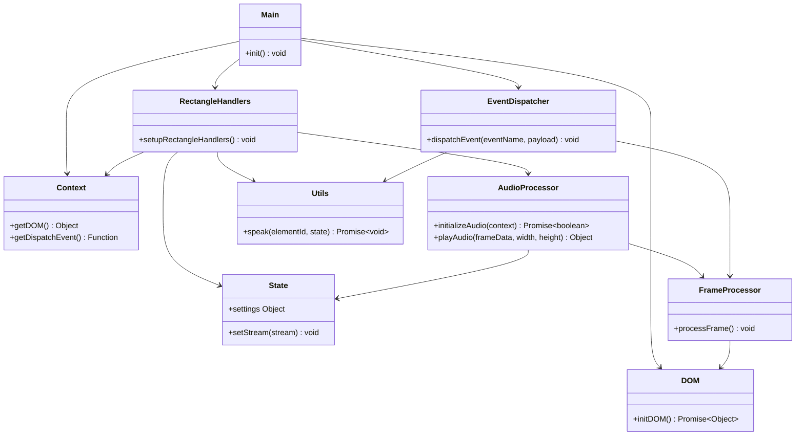

# Contributing to AcoustSee
Welcome to `acoustsee`! We’re building spatial audio navigation for the visually impaired, and we’d love your help and have fun with us.

## How to contribute

1. The `developing` branch is our zone that rapid deploys to GitHub Pages for easy and broad testing.
2. At `developing` branch, you can create new artifacts in `future` folder, meant as placeholder to play around new ideas and radical changes, where you could create a folder name of your liking and do as you like inside it.
4. You can compare your new artifacts among the consolidated files from the `past` or `present` folder.
5. You could add unit tests in `tests/` and run `npm test`.
6. Submit a PR to `developing` with a clear description.

Q: Wich is the content and purpuse of the other folders?

A:
  `past` #Historical files, usefull to have them at hand for easy comparsion to vibe a new develop.
  `future`  #Our playground, a place holder for your new features or to make radical changes. 
  `present` #Here you can PR the integration resulted from your `future`. // (Considering removing it for simplicity and moving this folder as the staging branch)
 

## Branches 

### Purpose of the Staging branch

- Testing and validation: The staging branch serves as a pre-production environment where changes are tested to ensure they work as expected and do not introduce bugs or regressions.
- Integration testing: It allows for integration testing of multiple features or bug fixes that are developed in parallel.
- User Acceptance Testing (UAT): Stakeholders or beta testers can review the changes in the staging environment to provide feedback before the final release.

### Example workflow with a Staging branch

- **Main branch:**
This is the production-ready code. It should always be in a deployable state.

- **Developing branch:**
This is the main development branch where new features and bug fixes are integrated. It is the equivalent of the `develop` branch in GitFlow.

- **Feature branches:**
Developers create `feature` branches from the `developing` branch to work on new features or bug fixes.
Once the `feature` is complete, a `pull request` is created to merge the `feature` branch back into the `developing` branch.

- **Staging branch:**
Periodically, the `developing` branch is merged into the `staging` branch to prepare for testing.
The `staging` branch is deployed to a staging environment where automated and manual testing can be performed.
Any issues found during testing are addressed by creating new feature branches from the develop branch and merging them back into develop.

- **Pull Requests to Staging:**
Once the changes in the `staging` branch pass all tests and reviews, a `pull request` is created to merge the `staging` branch back into the `main` branch.

- **Release:**
The `main` branch is then deployed to production.

## Contribution Types

### Adding a New Language
- Create a new file in `web/languages/` (e.g., `fr-FR.json`) based on `en-US.json`.
- Update `web/ui/rectangle-handlers.js` to include the language in the `languages` array.
- Example:
  ```json
  // web/languages/fr-FR.json
  {
      "settingsToggle": "Paramètres {state}",
      "modeBtn": "Mode {mode}",
      ...
  }
  ```
  ```javascript
  // web/ui/rectangle-handlers.js
  const languages = ['en-US', 'es-ES', 'fr-FR'];
  ```

### Adding a New Grid or Synthesis Engine
- Add a new file in `web/synthesis-methods/grids/` (e.g., `new-grid.js`) or `web/synthesis-methods/engines/` (e.g., `new-engine.js`).
- Update `web/ui/rectangle-handlers.js` to include the new grid/engine in `settings.gridType` or `settings.synthesisEngine` logic.
- Example:
  ```javascript
  // web/synthesis-methods/grids/new-grid.js
  export function mapFrame(data, width, height) {
      // Your mapping logic
      return data;
  }
  ```

### Fixing Bugs
- Check [Issues](https://github.com/MAMware/acoustsee/issues) for open bugs.
- Use the issue template to describe your fix.

## Submitting Changes

1. **Create a Branch**:
   ```bash
   git checkout -b feature/your-feature-name
   ```
2. **Commit Changes**:
   ```bash
   git add .
   git commit -m "Add feature: describe your change"
   ```
3. **Push and Create a PR**:
   ```bash
   git push origin feature/your-feature-name
   ```
   Open a Pull Request on GitHub, referencing the related issue.

## Code Style
- Use JSDoc comments for functions (see `web/ui/event-dispatcher.js`).
- Follow ESLint rules (run `npm run lint`).
- Keep code modular, placing UI logic in `web/ui/`.

## Testing
- Add tests in `tests/` for new features (see `tests/rectangle-handlers.test.js`).
- Run tests:
  ```bash
  npm test
  ```

Below is a curated to-do list to onboard collaborators, aligning with SWEBOK 4 (Software Engineering Body of Knowledge, 4th Edition), adopting  naming conventions, ensuring correct modularity, and sets a solid ground for AcoustSee. 

Each item includes a rationale tied to open-source success and a Mermaid diagram where relevant to visualize structure or process. 

Adopt SWEBOK 4 Practices for Maintainability and Quality

Objective: Align AcoustSee with SWEBOK 4 to ensure robust software engineering practices, making it easier for contributors to maintain and extend the codebase.

To-Do:

- Software Design (SWEBOK 4, Chapter 3):
    - Document the architecture using a modular design, separating concerns (e.g., UI, audio processing, state management).
    - Use context.js for dependency injection to decouple modules, as seen in your codebase.
- Software Testing (SWEBOK 4, Chapter 5):
    - Create unit tests for critical modules (e.g., rectangle-handlers.js, audio-processor.js) using Jest or Mocha.
    - Add integration tests for the frame-to-audio pipeline (e.g., frame-processor.js → grid-dispatcher.js → audio-processor.js).
- Software Maintenance (SWEBOK 4, Chapter 7):
    - Set up a CONTRIBUTING.md file with guidelines for code reviews, testing, and issue reporting.
    - Use GitHub Actions for CI/CD to automate linting, testing, and deployment.

Rationale: SWEBOK 4 ensures a standardized approach, attracting skilled contributors familiar with industry best practices, testing and CI/CD.

**Mermaid Diagram**: High-Level Architecture


Modular architecture separating UI (DOM, Utils), state (State), events (EventDispatcher), and audio processing (AudioProcessor, FrameProcessor).


Set up Jest for unit tests and GitHub Actions for CI/CD.

Standard Naming Conventions 

Objective: Adopt consistent naming conventions to improve code readability and maintainability, aligning with open-source standards.

File and Module naming:
    Use kebab-case for files (e.g., rectangle-handlers.js, audio-processor.js),
    Refactor service files to PascalCase (e.g., Context.js, EventDispatcher.js) to distinguish them from utilities.
    Keep camelCase for functions and variables (e.g., setupRectangleHandlers, settings.language)

Translation Files:
    Ensure languages/en-US.json, languages/es-ES.json use consistent locale codes (e.g., en-US, not en-us).

Documentation:
    Add JSDoc comments to exports (e.g., speak, initializeAudio) for clarity.

Enhance Modularity for Scalability
Objective: Restructure AcoustSee for correct modularity, reducing coupling and enabling easier contributions.

To-Do:

Refactor Dependencies:
Centralize dependency injection in Context.js (e.g., getDOM, getDispatchEvent) to avoid direct imports of DOM or dispatchEvent.
Move shared constants (e.g., updateInterval, audioInterval) to a config.js module.

Isolate Audio Pipeline:
Create a dedicated audio/ folder for audio-processor.js, grid-dispatcher.js, sine-wave.js, fm-synthesis.js, hex-tonnetz.js, circle-of-fifths.js.
Export a single AudioService from audio/index.js to simplify imports.

Decouple UI and Logic:
Move settings-handlers.js, utils.js, frame-processor.js to ui/handlers/ for clarity.
Use event-driven communication via EventDispatcher.js for all UI-logic interactions.

Build Tooling:
Use Vite or Webpack to bundle modules, ensuring correct path resolution (e.g., ../languages/${lang}.json).
Configure a base path (e.g., /acoustsee/future/web/) to avoid hardcoded paths.

**Audio pipeline**

```mermaid
graph LR
    A[RectangleHandlers] -->|dispatchEvent('processFrame')| B[EventDispatcher]
    B --> C[FrameProcessor]
    C --> D[AudioService]
    D --> E[AudioProcessor]
    D --> F[GridDispatcher]
    F --> G[HexTonnetz]
    F --> H[CircleOfFifths]
    E --> I[SineWave]
    E --> J[FMSynthesis]
    D -->|playAudio()| K[Audio Output]
```
Modular audio pipeline with AudioService as the entry point.

TO-DO:

Create audio/ folder and AudioService module.
Refactor imports to use Context.js exclusively.
Set up Vite with a base path in vite.config.js.


## Current Dependency Map

main.js:
Imports: setupRectangleHandlers (./ui/rectangle-handlers.js), setupSettingsHandlers (./ui/settings-handlers.js), createEventDispatcher (./ui/event-dispatcher.js), initDOM (./ui/dom.js)

Exports: None

Dependencies: Passes DOM to setupRectangleHandlers, setupSettingsHandlers, createEventDispatcher

dom.js:
Imports: None

Exports: initDOM (returns DOM object)

Dependencies: None

rectangle-handlers.js:
Imports: processFrame (./frame-processor.js), initializeAudio, isAudioInitialized, setAudioContext (../audio-processor.js), settings, setStream, setAudioInterval, setSkipFrame (../state.js), speak (./utils.js)

Exports: setupRectangleHandlers

Dependencies: Receives DOM and dispatchEvent, passes DOM to processFrame

settings-handlers.js:
Imports: settings (../state.js), speak (./utils.js)

Exports: setupSettingsHandlers

Dependencies: Receives DOM and dispatchEvent

event-dispatcher.js:
Imports: setAudioInterval, settings (../state.js), processFrame (./frame-processor.js), speak (./utils.js)

Exports: dispatchEvent, createEventDispatcher

Dependencies: Receives DOM, passes DOM to processFrame

frame-processor.js:
Imports: playAudio (../audio-processor.js), skipFrame, setSkipFrame, prevFrameDataLeft, prevFrameDataRight, setPrevFrameDataLeft, setPrevFrameDataRight, frameCount, lastTime, settings (../state.js)

Exports: processFrame

Dependencies: Receives DOM as a parameter

state.js:
Imports: None

Exports: settings, skipFrame, prevFrameDataLeft, prevFrameDataRight, frameCount, lastTime, setStream, setAudioInterval, setSkipFrame, setPrevFrameDataLeft, setPrevFrameDataRight

Dependencies: None

audio-processor.js (assumed):
Imports: Unknown (likely settings from ../state.js)

Exports: playAudio, initializeAudio, isAudioInitialized, setAudioContext

Dependencies: Unknown

utils.js:
Imports: Unknown

Exports: speak

Dependencies: Unknown


## Code of Conduct
Please be kind, inclusive, and collaborative. Let’s make accessibility tech awesome!

## Questions?
Reach out via [Issues](https://github.com/MAMware/acoustsee/issues).

Happy contributing!
