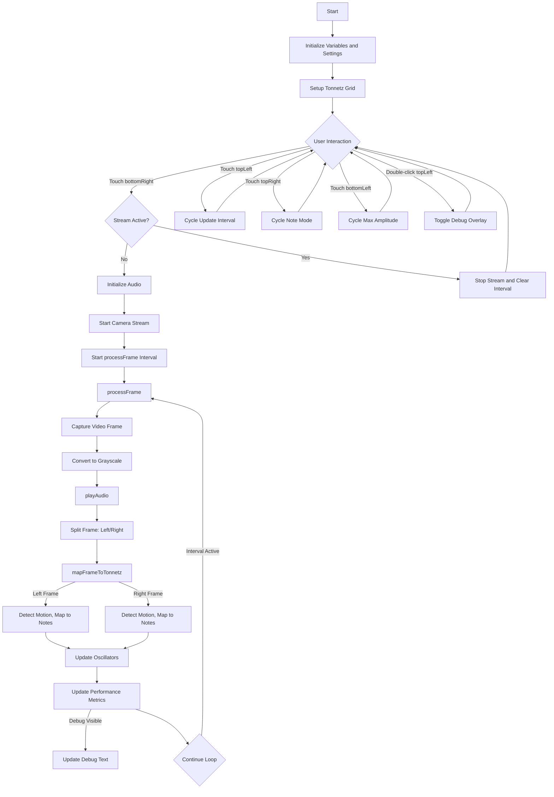
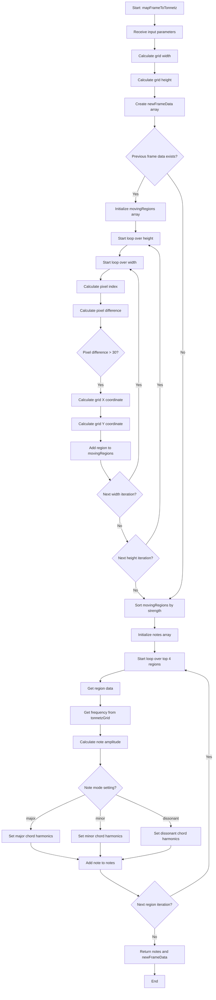
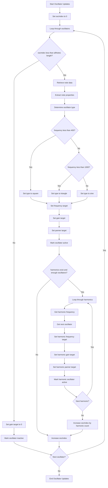
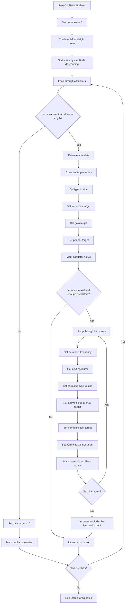

## Analysis
(5/18/2024, first two graphs are not updated to last main.js)

**Main Components:**
-  Audio Initialization: initializeAudio sets up the audio context and oscillators.
-  Tonnetz Grid: A 16x16 grid maps frequencies based on a circle of fifths for musical notes.
-  Frame Processing: mapFrameToTonnetz and playAudio process video frames to detect motion and map it to musical notes.
-  User Interactions: Touch events on topLeft, topRight, bottomLeft, and bottomRight adjust settings (FPS, note mode, amplitude) or start/stop navigation.
-  Frame Loop: processFrame captures video frames, converts them to grayscale, and triggers audio playback.

**Flow:**
 - The program starts with initialization (audio and grid setup).
 - User interactions (touch events) trigger settings changes or start/stop the video/audio loop.
 - The main loop (processFrame) processes video frames and generates audio based on motion.
 - Debug overlay toggles visibility and displays performance metrics.

**Key Functions:**
 - initializeAudio: Sets up oscillators for sound generation.
 - mapFrameToTonnetz: Maps video frame motion to musical notes.
 - playAudio: Processes frames and updates oscillators.
 - processFrame: Drives the main video-to-audio loop.

**The mapFrameToTonnetz function:**

  Takes parameters: 
  - frameData (grayscale pixel data), width, height,
  - prevFrameData (previous frame for motion detection),
  - panValue (stereo panning, -1 for left, 1 for right).0
 - Calculates grid dimensions (gridWidth, gridHeight) by dividing the frame into a 16x16 grid.
 - Creates a new newFrameData array to store the current frame.
 - Detects motion by comparing the current frame (frameData) with the previous frame (prevFrameData):
   - Iterates over each pixel in the frame.
   - Computes the absolute difference (delta) between corresponding pixels.
   - If delta > 30 (motion threshold), records the grid coordinates (gridX, gridY), intensity, and delta in movingRegions.
 - Sorts movingRegions by delta (motion strength) in descending order.
 - Selects up to 4 regions with the strongest motion.
  For each selected region:
   - Retrieves the frequency from the tonnetzGrid using gridX and gridY.
   - Calculates amplitude based on delta (scaled between 0.02 and settings.maxAmplitude).
   - Assigns harmonics based on settings.noteMode:
     - Major: Adds major third and fifth (freq * 2^(4/12), freq * 2^(7/12)).
     - Minor: Adds minor third and fifth (freq * 2^(3/12), freq * 2^(7/12)).
     - Dissonant: Adds tritone (freq * 2^(6/12)).
   - Stores the note data (freq, amplitude, harmonics, pan) in the notes array.
 - Returns an object containing notes and newFrameData.

**The oscillator update logic in playAudio:**

 - Takes the allNotes array (combining notes from left and right frames) and iterates over the oscillators array.
  For each oscillator (up to 8, indexed by oscIndex):
   - If the oscillator index is within the allNotes length:
     - Assigns the note's freq, amplitude, harmonics, and pan to the oscillator.
     - Sets the oscillator type based on frequency (square for < 400 Hz, triangle for < 1000 Hz, sine otherwise).
     - Uses setTargetAtTime to smoothly transition frequency, gain, and panning over 0.015 seconds.
     - If harmonics exist and there are enough oscillators, updates additional oscillators with harmonic frequencies and reduced amplitude (0.5x).
     - Marks the oscillator as active.
   - Otherwise, sets the gain to 0 and marks it as inactive.
 - Increments oscIndex to track the next available oscillator, accounting for harmonics.

Original: 
- Located in playAudio, starting around line 152.
- allNotes is created by combining leftResult.notes and rightResult.notes.
- Oscillator type is dynamically set based on frequency:
square if freq < 400 Hz.
triangle if freq < 1000 Hz.
sine otherwise.
- Up to 8 oscillators, with harmonics assigned to additional oscillators (amplitude * 0.5).
- Loop structure: Iterates over oscillators, assigning notes and harmonics, or silencing unused oscillators.

Updated:
- Located in playAudio, starting around line 152.
Key differences:
- allNotes is now sorted by amplitude in descending order: const allNotes = [...leftResult.notes, ...rightResult.notes].sort((a, b) => b.amplitude - a.amplitude);.
- Oscillator count increased to 32 (from 8).
- Oscillator type is fixed to 'sine' (no frequency-based type selection).
- Harmonic assignment logic remains the same (amplitude * 0.5 for harmonics).
- Core loop structure is unchanged: iterates over oscillators, assigns notes and harmonics, or silences unused oscillators.

