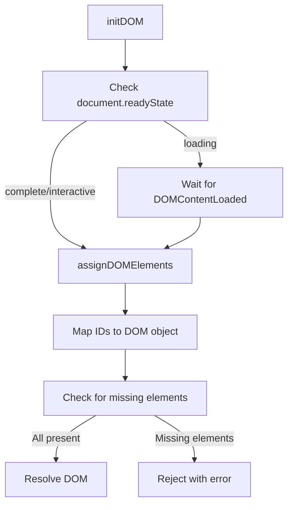

```mermaid
graph TD
    A[initDOM] --> B[Check document.readyState]
    B -->|complete/interactive| C[assignDOMElements]
    B -->|loading| D[Wait for DOMContentLoaded]
    D --> C
    C --> E[Map IDs to DOM object]
    E --> F[Check for missing elements]
    F -->|All present| G[Resolve DOM]
    F -->|Missing elements| H[Reject with error]
```
