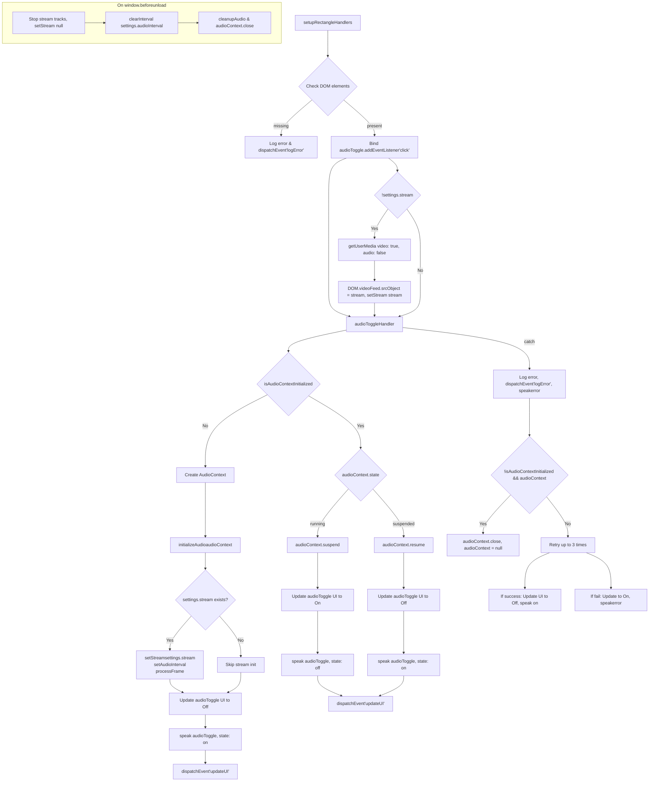
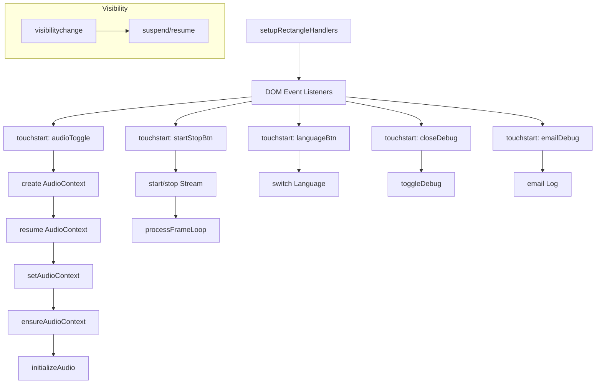

v0.9.8.9 Diagram as per Copilop chat

```mermaid
flowchart TD
    A[setupRectangleHandlers] --> B{Check DOM elements}
    B -- missing --> C[Log error & dispatchEvent'logError']
    B -- present --> D[Bind audioToggle.addEventListener'click']
    D --> E[audioToggleHandler]
    
    E --> F{isAudioContextInitialized}
    F -- No --> G[Create AudioContext]
    G --> H[initializeAudioaudioContext]
    H --> I{settings.stream exists?}
    I -- Yes --> J[setStreamsettings.stream\nsetAudioInterval\nprocessFrame]
    I -- No --> K[Skip stream init]
    J --> L[Update audioToggle UI to Off]
    L --> M[speak audioToggle, state: on]
    M --> N[dispatchEvent'updateUI']
    K --> L

    F -- Yes --> O{audioContext.state}
    O -- running --> P[audioContext.suspend]
    P --> Q[Update audioToggle UI to On]
    Q --> R[speak audioToggle, state: off]
    R --> S[dispatchEvent'updateUI']
    O -- suspended --> T[audioContext.resume]
    T --> U[Update audioToggle UI to Off]
    U --> V[speak audioToggle, state: on]
    V --> S

    E -->|catch| W[Log error, dispatchEvent'logError', speakerror]
    W --> X{!isAudioContextInitialized && audioContext}
    X -- Yes --> Y[audioContext.close, audioContext = null]
    X -- No --> Z[Retry up to 3 times]
    Z --> AA[If success: Update UI to Off, speak on]
    Z --> AB[If fail: Update to On, speakerror]
    
    D --> AC{!settings.stream}
    AC -- Yes --> AD[getUserMedia video: true, audio: false]
    AD --> AE[DOM.videoFeed.srcObject = stream, setStream stream]
    AE --> E
    AC -- No --> E

    subgraph Cleanup [On window.beforeunload]
      AF[Stop stream tracks, setStream null]
      AG[clearInterval settings.audioInterval]
      AH[cleanupAudio & audioContext.close]
      AF --> AG --> AH
    end
```

v0.9.8.8 Diagram as per chat https://x.com/i/grok?conversation=1929542935810314370 Jun 7, 2025

```mermaid
graph TD
    A[setupRectangleHandlers] --> B[DOM Event Listeners]
    B --> C[touchstart: audioToggle]
    B --> D[touchstart: startStopBtn]
    B --> E[touchstart: languageBtn]
    B --> F[touchstart: closeDebug]
    B --> G[touchstart: emailDebug]
    C --> H[create AudioContext]
    H --> I[resume AudioContext]
    I --> J[setAudioContext]
    J --> K[ensureAudioContext]
    K --> L[initializeAudio]
    D --> M[start/stop Stream]
    M --> N[processFrameLoop]
    E --> O[switch Language]
    F --> P[toggleDebug]
    G --> Q[email Log]
    subgraph Visibility
        R[visibilitychange] --> S[suspend/resume]
    end
```
