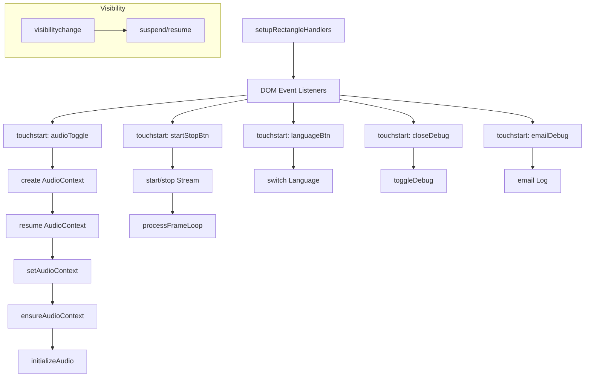

Diagram as per chat https://x.com/i/grok?conversation=1929542935810314370 Jun 7, 2025

```mermaid
graph TD
    A[setupRectangleHandlers] --> B[DOM Event Listeners]
    B --> C[touchstart: audioToggle]
    B --> D[touchstart: startStopBtn]
    B --> E[touchstart: languageBtn]
    B --> F[touchstart: closeDebug]
    B --> G[touchstart: emailDebug]
    C --> H[create AudioContext]
    H --> I[resume AudioContext]
    I --> J[setAudioContext]
    J --> K[ensureAudioContext]
    K --> L[initializeAudio]
    D --> M[start/stop Stream]
    M --> N[processFrameLoop]
    E --> O[switch Language]
    F --> P[toggleDebug]
    G --> Q[email Log]
    subgraph Visibility
        R[visibilitychange] --> S[suspend/resume]
    end
```
